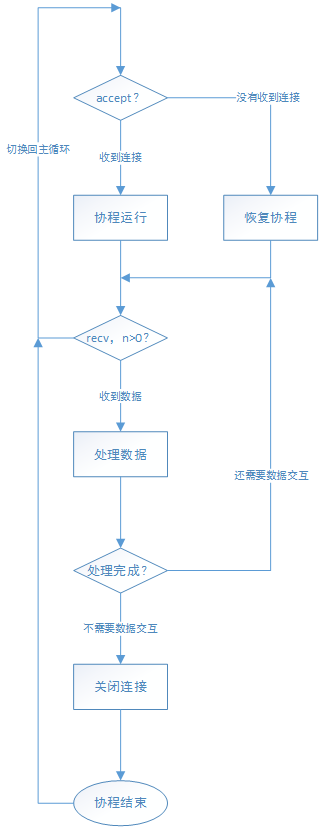
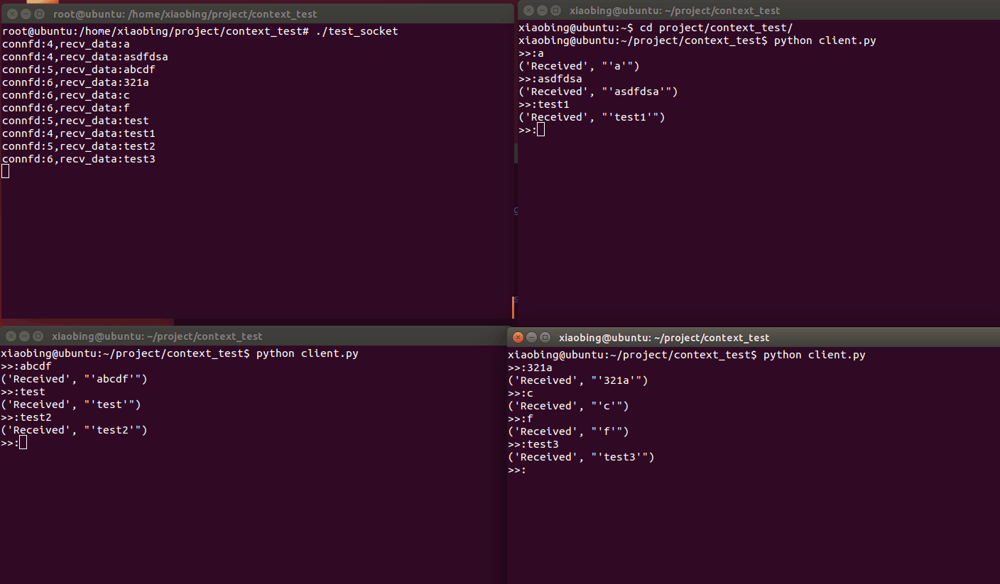

## C语言实现协程（三）
### 回顾
协程常用于IO密集型，但是目前我们仅仅是实现协程的切换与调度，并没有实战检验我们的协程库。接下来我们就用我们自己实现的协程库，实现一个非阻塞的socket服务器。

### 实现思路
我们已经实现了协程的切换恢复等功能。
现在我们要实现的是，当协程一个IO没有数据时我们不等待，而切换到下一个IO进行处理。
如果做一个比喻的话，大概就是像上学的时候老师一个一个听学生背课文。学生一个一个排好队，第一个同学上来，老师询问会背了吗？会,那么就背诵；不会，到旁边去准备，然后继续下一个同学询问是否背诵，接着又会询问之前的同学是否会背诵。
这里的主循环就是不断接收同学并询问是否已经会背诵，而同学背诵的过程就是协程执行的过程，可以看到同时只能有一个同学在背诵。
这里的同学可以理解成同学，而老师就是主逻辑负责不断询问各个IO是否准备好，而不会背诵就是未准备好，就需要切换IO，而前面拿起课本走过来的动作就不需要做了，相当于保存了执行状态。

### 思路图


### 实现
需要实现两个函数：
一、主循环接收连接并轮询连接的请求
主循环不断accept检测是否有新的连接，并不断恢复旧的协程。
二、连接的数据处理逻辑
连接处理会判断是否有数据，有就会根据业务情况进行处理，否则则进行协程的切换。
### 测试
这里编写两个简单的python脚本进行测试。
第一个用户输入数据并不断发送，可以同时开启多个脚本进行测试。
```
import socket
 
HOST = 'localhost'    # The remote host
PORT = 8888           # The same port as used by the server
s = socket.socket(socket.AF_INET, socket.SOCK_STREAM)
s.connect((HOST, PORT))
while True:
    msg = raw_input(">>:")
    s.sendall(msg)
    data = s.recv(1024)
 
    print('Received', repr(data))
s.close()
```
第二个多线程不断发送请求进行测试。
```
#coding: utf8
import socket
import sys
import threading
from time import ctime,sleep

threads = []

def connect_send():
    count = 0
    t = threading.current_thread()
    tid = t.ident
    res = "count:"+str(count)+"__tid:"+str(tid)
    sock = socket.socket(socket.AF_INET, socket.SOCK_STREAM)
    sock.connect(('127.0.0.1', 8888))
    sock.send(res)
    szBuf = sock.recv(1024)
    print szBuf
    while(szBuf != 'exit'):
        count += 1
        res = "count:"+str(count)+"__tid:"+str(tid)
        sock.send(res)
        szBuf = sock.recv(1024)
        print("recv:" + szBuf)
        sleep(0.1)
        if(count > 10):
            break
    sock.close()

for i in xrange(100):
    t = threading.Thread(target=connect_send, args=())
    threads.append(t)

if __name__ == '__main__':
    for t in threads:
        t.start()
```
可以看到该服务端程序能在单线程情况下响应多个连接。

### 总结
这里使用我们自己实现的协程，实现了非阻塞socket的服务端，了解了协程如何处理IO问题及处理IO的过程。实际使用过程会比这个复杂，但基本原理相同。